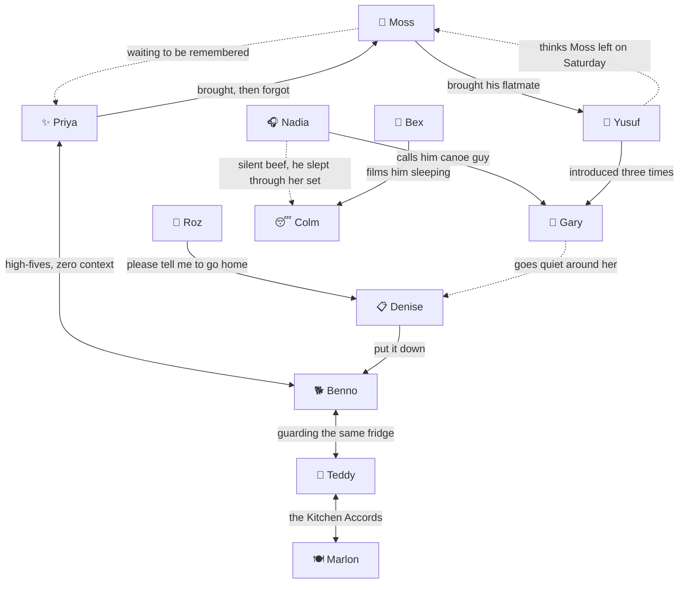

# The Lore Drop 🎉

### Everything you need to know about the twelve people who will not leave your house

> It has been fifty-two hours. The party has not ended. It has *evolved.*

This is the unofficial character bible for **Life of the Party**: who everybody
is, how they got here, why they won't leave, and what they're like when you
finally get them to the door. It's built on what the game actually says about
them (the taglines, dossiers and barks in [`src/game/cast.ts`](src/game/cast.ts)),
and then we filled in the gaps, spilled the tea, and asked the important
questions. Like: *what happened to Keith?*

> [!NOTE]
> **Spoiler policy.** Everything outside the 🔒 boxes is spoiler-light, the kind
> of thing you'd pick up by hanging around a guest in-game. Inside each 🔒 box is
> what that guest is *secretly drawn to*. The game wants you to work that out
> yourself, by watching people or by earning the cameras, so open them at your
> own risk. No judgement. (A little judgement.)

---

## The Guest List

| | Guest | Known as | Found in | Condition | The vibe |
|---|---|---|---|---|---|
| 🛶 | [Gary](#gary) | Canoe Guy | The Ballroom | 🤢 Rough Shape | Came to complain, stayed for the vibes |
| 📋 | [Denise](#denise) | The Only Sober One | The Kitchen | 🥴 Merely Tipsy | "HR is typing…" |
| 🌿 | [Moss](#moss) | Didn't Want to Come | The Study | 🧟 Mutating | The "this is fine" dog, but it's a guy |
| ✨ | [Priya](#priya) | Patient Zero | The Foyer | 🥴 Merely Tipsy | Girlbossing too close to the sun |
| 🐕 | [Benno](#benno) | The Keg Guy | The Kitchen | 🤢 Rough Shape | Golden retriever in a person costume |
| 🧥 | [Roz](#roz) | Four Goodbyes | The Foyer | 🥴 Merely Tipsy | A goodbye with no end date |
| 🍳 | [Teddy](#teddy) | The Chef Nobody Hired | The Kitchen | 🤢 Rough Shape | Let him cook |
| 🎧 | [Nadia](#nadia) | Owner of The Speaker™ | The Ballroom | 🤢 Rough Shape | Gatekeeping the aux since Friday |
| 😴 | [Colm](#colm) | Asleep | Guest Room Two (upstairs) | 🥴 Merely Tipsy | Sleepmaxxing |
| 🙇 | [Yusuf](#yusuf) | Somebody's Plus-One | The Rec Room (basement) | 🤢 Rough Shape | Knows where your stuff is. Won't say how. |
| 📱 | [Bex](#bex) | The Documentarian | The Theater | 🧟 Mutating | Four hours of drafts, zero posts |
| 🍽️ | [Marlon](#marlon) | Seconds Guy | The Dining Room | 🧟 Mutating | Every plate has load-bearing garlic bread |

**Condition, from bad to worse:** 🥴 Merely Tipsy → 🤢 Rough Shape → 🧟 Mutating →
💀 Feral. Everybody slides one stage every six hours, and sooner if you wind them
up enough.

**The house has three floors now.** Everyone starts on the ground floor except
Colm, who is asleep upstairs, and Yusuf, who is alone in the basement for reasons
we'll get to.

**Also starring:** [You, the Host](#you-the-host) ·
[Sean (classified)](#classified-sean) ·
[The Saturday Incident](#the-saturday-incident) ·
[Unsolved Mysteries](#unsolved-mysteries) ·
[The Tier List](#the-official-unofficial-tier-list) ·
[The Cheat Sheet](#the-cheat-sheet)

---

## Gary

**🛶 Canoe Guy.** *Your upstairs neighbour. Came down to complain.*

> *"Great party. Great, great party."*

**Found in:** The Ballroom · **Starts:** 🤢 Rough Shape · **Fit check:**
swept-back hair, a blue jacket, big shoulders, and the face of a man who forgot
why he came downstairs

At hour four, Gary knocked on your door to ask you to turn it down. That was two
days ago. He is the noise complaint that became the noise. He came to shut the
party down and the party shut *him* down instead. A villain origin story, but
backwards.

He says he lives upstairs. Upstairs is your bedrooms. He does not live in any of
them. Nobody has asked a follow-up question. All anyone knows for sure is that
there's a smoke alarm up there that chirps once and gives up, which is also
Gary's whole energy. The canoe lives rent-free in his head. Gary lives rent-free
in your house.

He has told the same story about a canoe to four different people. Here's
everything the house has pieced together: there was a lake, there was a canoe,
and there was a man called Keith. Every time Gary reaches the part about Keith,
he stops, stares into the middle distance, and says "anyway." Nobody has heard
the ending. Nobody knows what happened to Keith. The canoe story is a canon
event. You can't stop it. Don't try.

He works in "operations." When asked what he operates, he tells the canoe story.
He hasn't been to work since Tuesday and seems weirdly at peace with that. He
keeps checking his phone, seeing nothing, putting it away, and checking it again.
That hurts, because somebody *else's* phone has been buzzing face-down on a table
for a whole day, and Gary would give anything for that kind of engagement.

There's a cat in his flat. He mentions it once, quietly, then changes the
subject. (The cat is fine. It has an automatic feeder and zero respect for Gary.
The cat is doing better than Gary. That's the sad part.)

When he finally goes, he waves at the house from the pavement. Nobody waves back.
If you're ever there when it happens: wave back. It's free.

| Vibe check | |
|---|---|
| **Most likely to** | Say "great party" at a funeral |
| **Roman Empire** | Keith |
| **Toxic trait** | Yells "THIS IS MY SONG" at every song. It is never his song. Once it was a ringtone. |
| **🚩 Red flag** | Says he lives upstairs. You've been upstairs. It's your bedrooms. |
| **💚 Green flag** | Dances like a man who has forgotten anyone can see him. Honestly? Goals. |
| **Aura** | −200 for dancing like a controlled fall. +500 for fully committing to it. |

**Relationships.** Nadia has been calling him "canoe guy" for a day and a half.
He has no idea, and it's too late to tell him. Yusuf has been introduced to him
three separate times, so Yusuf has heard about Keith three times and gasped at
the same bit every time. And Gary goes very quiet whenever Denise looks at him.
Is it a crush? Is it fear? Chat, is this rizz? (There's a theory. See
[Unsolved Mysteries](#unsolved-mysteries).)

🔒 <b>Spoiler: what actually moves Gary</b>

**Heavy Bass.** "Oh, that's the good stuff" was never about the snacks.

- Both speakers are indoors (the back of the Ballroom, and the Rec Room
  downstairs), so music can *park* Gary, but it can't walk him out the front
  door. The last stretch is on you.
- Heading toward his thing calms him down. The catch: the moment the music goes
  on, every guest who can't stand noise starts clearing out of whatever room
  they're in.
- He starts in the same room as Nadia *and* the Ballroom speaker. One switch, two
  very happy people, several very unhappy others.

---

## Denise

**📋 The Only Sober One.** *Somehow the only sober person here.*

> *"Fascinating," says Denise, to nobody.*

**Found in:** The Kitchen · **Starts:** 🥴 Merely Tipsy (Denise disputes this) ·
**Fit check:** curls, earrings, a raspberry cardigan, cream trousers, and white
trainers that are *still white* after fifty-two hours. Scientists are baffled.
Nothing has been spilled on Denise. Nothing would dare.

Denise has been taking mental notes since hour one. She has not said why. Is it a
book? A police statement? A one-star review of your house? Nobody knows, and
everybody's lowkey scared. Her energy is "HR is typing…"

She knows where you keep the bin bags. You have never told her. She has quietly
done the washing-up twice, and neither time did anybody notice, which is the
Denise experience in one sentence. She is the mum friend, the designated adult
and the unpaid operations manager of this party. Nobody offered her any of those
jobs. She took them anyway. Mother.

She was supposed to be at her sister's on Sunday. It is Tuesday. Her sister has
texted "u alive??" eleven times, and Denise has left her on read, which is
ironic, because Denise reads *everything*. (Her sister has started taking notes.
It runs in the family.)

She starts the night with an agitation of zero, the only zero in the building.
Keep it that way. Don't shove Denise. She doesn't fall. She simply relocates, and
remembers this. There is a page in the notes now. It has your name at the top.

Late in the night she's still taking notes, but the handwriting has changed. We
don't talk about the new handwriting.

When she finally goes, it's "Right. Well. Thank you for having me," and she takes
a bin bag out with her on the way. Ten out of ten guest. Would invite again.
(Terrifying.)

| Vibe check | |
|---|---|
| **Most likely to** | Hand you a fourteen-page incident report nobody asked for, and be right about all of it |
| **Roman Empire** | "There is a system to this kitchen and I intend to find it." |
| **Toxic trait** | Eats standing up, judging everything |
| **🚩 Red flag** | Knows where your bin bags are |
| **💚 Green flag** | Knows where your bin bags are |
| **Aura** | +1000. Unbothered. Moisturised. In her lane, and occasionally in yours, taking notes. |

**Relationships.** She is the only person at the party who tells Benno what to do.
("Benno. Put it down." Benno does not put it down.) Roz keeps begging Denise to
tell her to go home, as if Denise is her accountability coach, which, honestly,
she might be. And Gary goes silent whenever Denise looks at him. Denise has
noticed. Denise notices everything.

🔒 <b>Spoiler: what actually moves Denise</b>

**Leftovers.** "I was going that way anyway."

- Denise follows food, but unlike the kitchen regulars she isn't *hungry*. She
  won't drift toward the fridge on her own until she's much further gone. With
  nothing on offer, she just… watches you.
- Food is the one lure you can put outdoors: a snack can go down on the lawn,
  and once *any* guest steps off the carpet onto the grass, they remember they
  have a home and head for the street on their own. One well-placed plate just
  outside the front door is basically a checkout button.
- She will act like leaving was her idea. Let her. That was always the plan.

---

## Moss

**🌿 Didn't Want to Come.** *Came with someone who already left.*

> *"No, this is — yeah. This is fine."*

**Found in:** The Study, the quietest room in the house, which he located within
four minutes of arriving · **Starts:** 🧟 Mutating (already) · **Fit check:**
shaggy ginger hair, an olive-green hoodie, and a scarf. Indoors. At a party.
Dressed like a forest. Named like a forest. Would rather be in a forest.

Moss did not want to come. Moss says this is fine, repeatedly. He is the "this is
fine" dog, except the room isn't on fire. It's just *loud*.

He works from home specifically so that this would never happen to him. It
happened to him anyway, because Priya invited him to "the thing," and Moss has
never successfully said no to anything in his life.

He has spent roughly nine of the last fifty hours in the bathroom. Not doing
anything. Just existing in the one room with a lock on the door. The Bathroom's
official description is "the only door in this house anybody still bothers to
shut." That's Moss. Moss is the anybody.

He has been holding the same warm drink since the first evening. It's room
temperature now. It *is* the room. It's his emotional-support beverage and he
will not be putting it down.

He walks in already Mutating and carrying more agitation than anyone else in the
house, so when you finally get the cameras working, Moss is usually one of the
first faces they pick out. The most stressed man in the building. Relatable.

He apologises to the person who pushed him. Late in the night he stops
apologising, and everyone agrees that is somehow worse.

His ending might be the best in the game: *"Moss is outside. He looks at the sky
like he has missed it."* He's the only character whose redemption arc is
literally touching grass. Then he walks off very fast without saying goodbye to
anybody. Irish goodbye, any% speedrun. New world record.

| Vibe check | |
|---|---|
| **Most likely to** | Say "sorry" to a door he walked into |
| **Roman Empire** | His own bed, forty minutes away, in the dark, in the silence |
| **Toxic trait** | Eats a single crisp, apologetically |
| **🚩 Red flag** | "No, it's fine." (It is not fine.) |
| **💚 Green flag** | Can find the quietest square metre of any building in under a minute. Genuinely elite skill. |
| **Aura** | Mysterious by accident. Never asked for attention. Somehow has the most lore. |

**Relationships.** Moss looks at Priya like he's waiting to be remembered. It's a
situationship where only one person knows it's a situationship. And then there's
Yusuf, which is a whole thing. Read [The Saturday Incident](#the-saturday-incident).
Bring tissues.

🔒 <b>Spoiler: what actually moves Moss</b>

**Quiet.** Moss isn't drawn *to* anything. He runs *from* noise.

- Switch on a speaker (anywhere in the house) and Moss backs away from it. The
  catch: "away" mostly means the far corner of the Study, where he stews. Music
  doesn't sweep Moss anywhere useful. It corners him.
- And every hour he's chased raises his agitation. He started the night Mutating
  and stressed, and twelve hours of Ballroom music takes him from 35 to 77. At
  100 he turns early. Be gentle with Moss. Moss has been through enough.
- Don't switch on the Study lamp while he's in there. It won't bother *him*, but
  it'll summon every light-chaser in the house into the one room he picked to be
  alone in. Don't do that to Moss.

---

## Priya

**✨ Patient Zero.** *Started all of this. Has not slept since.*

> *"Wait — wait, no, listen. LISTEN."*

**Found in:** The Foyer, holding court · **Starts:** 🥴 Merely Tipsy (how??) ·
**Fit check:** a purple dress, a high ponytail, earrings, and the thousand-yard
stare of someone who has come out the other side of sleep

This was Priya's idea. She calls it "the thing" and will not elaborate. Are you
coming to the thing? The thing is still going. The thing has a life of its own
now. (It does. That's the problem. That's the whole game.)

She has been awake for all fifty-two hours of it. She isn't tired. She has
transcended tired. She has seen the face of God, and it was a disco ball. She is
girlbossing too close to the sun, and the sun is starting to look worried.

Priya is the main character, and everybody else is an extra in her movie. Nobody
auditioned. She tells stories with no beginning. She changes direction
mid-sentence and never finishes the sentence. She dances like the party is a
thing she has to keep alive by hand. "BEST NIGHT OF MY LIFE," she screams. It is
a Tuesday afternoon.

And here's the scary part: she keeps texting more people to come. Some of them
are on their way. The party has DLC, and Priya keeps downloading it.

She brought Moss. She has not thought about Moss since the first night. Mention
him and she'll gasp "oh my god, MOSS!" with total, genuine love, and then forget
him again within four minutes.

She is the only person in the house you can shove who will hype you up for it.
("Whoa! Okay! Rude! Love that though.") Please do not take that as permission.

At the very end she'll ask, "Wait, is it over? Is it over?" It has been over for
a day. She leaves promising to do this again. She means it. Lock your doors next
weekend.

| Vibe check | |
|---|---|
| **Most likely to** | Start a group chat called "THE THING 2 🔥🔥🔥" before she reaches the end of your street |
| **Roman Empire** | The thing |
| **Toxic trait** | Every sentence starts with "okay so" and none of them end |
| **🚩 Red flag** | "Some of them are on their way." |
| **💚 Green flag** | Genuinely, unconditionally thrilled to be here. It's kind of beautiful. From a distance. |
| **Aura** | Unmeasurable. The aura meter broke at hour thirty. |

**Relationships.** Priya and Benno high-five for no reason at all: chaos besties,
zero context, flawless synergy. She is also the reason Moss is here, a fact she
will learn, fresh, several more times tonight.

🔒 <b>Spoiler: what actually moves Priya</b>

**Bright Light.** Priya "goes toward it immediately, like a moth with somewhere
to be." The game told you. It literally told you.

- Lamps pull her in, and so does the surveillance PC, because a monitor is a
  light. The desk is in your bedroom upstairs, which is off-limits. Leave the
  screen on and Priya will moth her way up the stairs and into the one room you
  can't let anybody into. It's a long walk, so it takes her a while. She gets
  there. Put the PC back to sleep when you're done with it.
- Every light in the game is indoors, so lamps can steer her but can't walk her
  out. The last few tiles are on you.
- She starts in the Foyer, seven steps from the lawn, closer to the way out than
  any other guest. Remember that when you're planning where the night ends.

---

## Benno

**🐕 The Keg Guy.** *Brought the keg. Ate everything else.*

> *"Anyone need anything? I'm up."*

**Found in:** The Kitchen (where else) · **Starts:** 🤢 Rough Shape ·
**Fit check:** a golden-blond quiff, a burnt-orange waistcoat, a big frame, and a
chain he wears like a dog tag. A golden retriever wearing a person costume. Big
"is this your ball? I found your ball" energy.

Benno brought the keg on the first night and considers this his full and final
contribution. He will be bringing this up for the rest of his life.

He has since eaten every single thing in this house that was not nailed down.
Benno doesn't steal food. He collects the fanum tax, and every snack in the
building has been taxed. He opens the fridge, looks in, closes it, and opens it
again. "I'm not even hungry. I just like knowing what's in there." It's not a
snack habit. It's a hobby. It's cardio.

He works for a removals company, which explains how he carried a keg in on his
own, why he moves like weather (slowly, and taking things with him), and why he
keeps offering to help clean up. He isn't joking. He genuinely wants to help.
Nobody takes him up on it. It's giving misunderstood.

And here is the most important thing in this entire document: **Benno has been
quietly making sure nobody drives home.** He's been collecting car keys in a
mixing bowl on top of the fridge, the one place in the house only Benno can
reach. Nobody has noticed him doing it. He doesn't need them to. Benno is the
reason everybody at this party is going to be okay, and he will never mention it
once.

He dances enormously and takes out a lamp. He dances with a chair, and the chair
loses. When he starts to mutate he's still smiling. There's just more of it now,
which is a lot.

When he finally goes, he takes three bin bags out on his way. Nobody asked. Not
Benno taking the bins out on his way home from a two-day party 😭

| Vibe check | |
|---|---|
| **Most likely to** | Mention the keg in his best man speech |
| **Roman Empire** | "There was a lasagne. I *know* there was a lasagne." |
| **Toxic trait** | Looks in a cupboard he has already looked in. Every hour. On the hour. |
| **🚩 Red flag** | You will never see the good cheese again |
| **💚 Green flag** | Literally the party's guardian angel, and nobody knows |
| **Aura** | Visible aura: +50. Hidden aura: +10,000. Benno is a secret-stats king. |

**Relationships.** He and Priya high-five for no reason at all. He and Teddy have
been guarding the same fridge for two days; nobody knows what from. Denise keeps
telling him, "Benno. Put it down." He does not put it down. What is "it"? It
changes. Once it was a lamp. Once, allegedly, it was Colm. He and Denise are also
locked in an unspoken bin-bag rivalry: she takes one out when she leaves, and he
takes three. Denise has noted this.

🔒 <b>Spoiler: what actually moves Benno</b>

**Leftovers.** And he's a kitchen regular, so even with nothing on offer he drifts
back toward the fridge by default.

- Food is the one lure you can lay outside. A snack on the lawn pulls him out
  the door, and once he's on the grass he heads for the street by himself.
- Opening the fridge calls *every* food-lover in the house at once. Great for a
  round-up. Less great if you wanted the kitchen empty.
- Chasing something he likes calms him down. Benno is easy to keep happy. That's
  his whole thing.

---

## Roz

**🧥 Four Goodbyes.** *Has said goodbye four times. Is still here.*

> *"Right. Right, okay. Two more minutes."*

**Found in:** The Foyer. The front door is *right there.* · **Starts:**
🥴 Merely Tipsy · **Fit check:** a red bob, glasses, and a teal jacket, which is
currently on. That's coat-on number three. Give it an hour.

Roz has put her coat on twice and taken it off twice. She has a train at six.
She has had a train at six since Saturday. The train has started to take it
personally.

She starts the night in the Foyer, the room whose official description is,
word for word, "The front door is right there. Nobody has used it in two days."
Roz has been standing next to it for both of them.

She keeps ending up back in the kitchen doorway, mid-sentence, coat in hand. It's
the Midwestern goodbye, stretched into a fifty-two-hour endurance event. "Okay.
Okay, this time I mean it. Love you. Bye. Love you." She is not leaving. She is
buffering.

Here's the sad part, and it's the whole character: **Roz doesn't actually want
to go. She wants somebody to ask her to stay.** She's been the "I should probably
head off" friend her whole life, and every time she says it she's quietly hoping
someone will go "nooo, stay." Nobody ever has. So she's giving it one more try.
She's been giving it one more try since Saturday.

She dances in her coat. It goes badly, and she does not care, and honestly that's
the most freeing thing that happens all night.

Late in the night, Roz stops mentioning the train. Nobody is sure whether that's a
good sign.

When she finally goes, she'll text about it for a week. Expect voice notes. Long
ones.

| Vibe check | |
|---|---|
| **Most likely to** | Say "okay, I'm heading out" and then start a brand-new story at the door |
| **Roman Empire** | The six o'clock train, which is more of a concept at this point |
| **Toxic trait** | "Two more minutes" is not a unit of time. It's a lifestyle. |
| **🚩 Red flag** | "I KNOW. I'm going. I am literally going." (She is literally not going.) |
| **💚 Green flag** | Says "love you" to everybody on the way out, and means it every time |
| **Aura** | Delulu, but in the way that makes you want to give her a hug |

**Relationships.** Roz keeps begging, "Denise, tell me to go home. Please just
tell me to go home." Denise is the one person Roz trusts to be honest with her.
Denise has not told her to go home. Draw your own conclusions.

🔒 <b>Spoiler: what actually moves Roz</b>

**Bright Light.** She's waiting for a sign. Literally any sign. A lamp counts.

- Like every light-chaser, lamps can steer her but can't lead her outside,
  because all the lights are indoors. And keep her away from the glowing monitor
  in your bedroom.
- She starts ten steps from the lawn. Only Priya starts closer. A few careful
  nudges and she's out.
- A nudge is eight whole minutes of you, the host, actually talking to her.
  Honestly? That might be what she was waiting for.

---

## Teddy

**🍳 The Chef Nobody Hired.** *Has not left the kitchen since Friday.*

> *"There's food if anyone wants food. There's food."*

**Found in:** The Kitchen. Obviously. · **Starts:** 🤢 Rough Shape ·
**Fit check:** a mustard cap, a striped top, olive trousers, and a spoon he
forgot he was holding. He's still dressed for a shift.

Teddy found the kitchen on the first night and never really came back out.
Nobody asked him to cook. Nobody is hungry. Let him cook.

He has reorganised your cupboards. They are, admittedly, better now. You will
never find anything again, but they're better. The spices are alphabetised. The
mugs all face the same way. There is a shelf labelled "EMERGENCY" and you do not
want to know.

What nobody knows: Teddy was a line cook at a little place across town that
closed in the spring. He hasn't told anybody. Your kitchen is the first one he's
had since. That's why everything he makes serves forty. Force of habit.

And the kitchen is the only room in the house where he doesn't have to talk to
anybody. If you're holding a hot pan, nobody expects small talk. That's the
trick. That's the whole trick.

The food is bussin. Nobody is hungry. Both things are true.

Do not shove Teddy. He will set the pan down very carefully first, and that is
somehow worse. That is the calm before the storm.

Late in the night, Teddy is still cooking. It is no longer clear what. The dish
has entered its experimental era. Something in the pan is making eye contact.

When he finally leaves, he says, "There's a lasagne in the fridge. Eat the
lasagne." The kitchen is cleaner than he found it. He ate and left no crumbs.
Literally. He wiped them up.

| Vibe check | |
|---|---|
| **Most likely to** | Be found at 4 a.m. making a béchamel for nobody |
| **Roman Empire** | "Right — who ate the good cheese." (Benno. It's always Benno.) |
| **Toxic trait** | Wipes down a counter that is already clean |
| **🚩 Red flag** | "It's no trouble. It's genuinely no trouble." (It is a lot of trouble.) |
| **💚 Green flag** | Will feed you whether you're hungry or not. That's love, actually. |
| **Aura** | Chef's kiss. Literally. |

**Relationships.** Teddy and Benno have been guarding the same fridge for two
days. Teddy and Marlon have an unspoken arrangement about the kitchen that
neither of them will explain. Historians call it **the Kitchen Accords**. Nobody
knows the terms. They involve nodding.

🔒 <b>Spoiler: what actually moves Teddy</b>

**Leftovers.** And he's a kitchen regular, so left to himself he drifts straight
back to the fridge like a homing pigeon.

- Food is the lure you can take outside. A plate on the lawn gets him out the
  door, and the grass does the rest.
- The kitchen is crowded at the start of the night. An open fridge pulls every
  food-lover toward the same corner: a great round-up or a traffic jam,
  depending on your plan.

---

## Nadia

**🎧 Owner of The Speaker™.** *It is her speaker. She will mention this.*

> *"No requests. I'm not doing requests."*

**Found in:** The Ballroom, across the dance floor from her speaker, keeping an
eye on it · **Starts:** 🤢 Rough Shape · **Fit check:** a top bun, a magenta
jacket, headphones, and spotless white trainers. She dresses like a DJ because
she *is* the DJ, and she will tell you.

Nadia brought the speaker and has not relinquished it for fifty-two hours. She
has been on aux since Friday. Nobody else is allowed on aux. The aux is not for
you. She's gatekeeping it like a family heirloom.

She has a rule about requests. The rule is no. It dates back to her first-ever
gig, her cousin's tenth birthday party, where somebody asked for "Baby Shark" and
she played forty minutes of dubstep at a bouncy castle instead. She was
asked to leave. She has not taken a request since. She regrets nothing.

She has been awake so long the set has stopped having a genre. It isn't house.
It isn't techno. Right now it's a washing-machine sample over a heartbeat, and it
slaps, weirdly.

If you turn the music off, she takes it personally. *Genuinely* personally. You
will be unfollowed on every platform, including the ones you're not on.

When she mutates, she starts beatmatching things that are not music: the fridge
hum, Benno's footsteps, Gary's laugh (which has gone wrong somewhere in the
middle, so it's in 7/8 now).

When she leaves, it's "I'm taking the speaker. Obviously I'm taking the speaker."
She carries it out like a wounded animal. Give her a minute.

| Vibe check | |
|---|---|
| **Most likely to** | Say "no requests" to the fire brigade |
| **Roman Empire** | The Rec Room downstairs is half a recording studio, and the booth still works |
| **Toxic trait** | Nods along to a track that isn't currently playing |
| **🚩 Red flag** | "Do NOT put your hands on me near the desk." |
| **💚 Green flag** | Has not let the vibe die once. Not once. Not in fifty-two hours. |
| **Aura** | Infinite, and she knows it. Slay. |

**Relationships.** Nadia has been calling Gary "canoe guy" for a day and a half.
And Colm slept through her *entire set*. Nadia has noticed. Colm is her nemesis,
and he has no idea, because he's unconscious, which, if you think about it, is
the most disrespectful thing a person can do.

🔒 <b>Spoiler: what actually moves Nadia</b>

**Heavy Bass.** "Nadia moves toward the sound like it owes her money."

- She starts across the dance floor from the Ballroom speaker. Switch it on and
  she heads straight for it, calmer with every step. Leave it off and she gets
  restless. Run something that isn't for her and she gets worse.
- There's a second speaker in the Rec Room downstairs. If she finds it, she has
  a studio. Good luck.
- Like Gary, music can park her but can't walk her out. The last stretch is
  yours.

---

## Colm

**😴 Asleep.** *Asleep. Has been asleep for some time.*

> *"Mm? Yeah. Yeah, I'm up."* (Colm is not up.)

**Found in:** Guest Room Two, upstairs, horizontally · **Starts:** 🥴 Merely
Tipsy, technically. Unconscious, practically. · **Fit check:** neatly parted grey
hair, glasses, and a navy cardigan. Full grandpacore. Either he's older than
everyone here, or he's been asleep so long his hair gave up waiting.

Colm came to the party straight off a double shift. He was going to have one
drink, say hello, and head home. He went for a lie-down "for five minutes." That
was Friday evening. He has not formally returned.

Every few hours he surfaces, says something weirdly lucid, and goes back under.
His main contribution to conversation is "yeah, no, exactly," and somehow it's
always the right answer.

He sleeps sitting up, which is a skill. He slept through Nadia's entire set,
which is a bigger one. At one point the music got so loud his *foot* started
dancing. Only his foot. His foot is having the best night of anyone at this
party.

Somebody keeps putting a blanket on him. Nobody will admit to it. (We have
suspects. See [Unsolved Mysteries](#unsolved-mysteries).)

Colm is the only person here who is going to feel fine tomorrow. He is
sleepmaxxing. While everybody else slowly turns into a hungover gremlin, Colm is
getting the best rest of his life. He is the most sigma person in the house, and
he's doing it unconscious.

Don't shove him. It's the one thing that properly wakes him up, for the first
time in a day, and it is not a good look. Late in the night he's still asleep,
but it's stopped looking restful. It's started looking like a loading screen.

His exit is the most iconic in the game: he stands, stretches, and walks out as
though this were always the plan. He goes home to sleep, which is a joke he would
appreciate. He understood the assignment. The assignment was a nap.

| Vibe check | |
|---|---|
| **Most likely to** | Sleep through the apocalypse (which, to be clear, is currently happening around him) |
| **Roman Empire** | His own pillow |
| **Toxic trait** | Falls asleep somewhere he should not be asleep |
| **🚩 Red flag** | Has been "resting his eyes" since Friday |
| **💚 Green flag** | The only guest with a healthy sleep schedule. Technically. |
| **Aura** | Unconscious aura. No thoughts, head empty, eyes closed. |

**Relationships.** Bex has forty minutes of footage of Colm asleep, which she
calls "a study." She has filmed him sleeping four times now. It's a parasocial
relationship, and he is the only person involved who doesn't know about it. And
Nadia has a whole beef with him that he has also slept through.

🔒 <b>Spoiler: what actually moves Colm</b>

**Quiet.** He isn't drawn to anything. He drifts away from noise.

- Switch on music and Colm shuffles away from it without ever fully waking up,
  to the far side of Guest Room Two, and no further. A speaker is the world's
  least effective alarm clock.
- Left alone he's the calmest guest in the house, and he just drifts. He's also
  upstairs, and at 45 steps from the lawn he's further from a way out than
  anybody. He is not finding his way out by himself. You'll be walking him.
- Being chased by music bumps his agitation every hour. He starts near zero, so
  he can take it, but it gets him nowhere.

---

## Yusuf

**🙇 Somebody's Plus-One.** *Everybody assumes he came with somebody else.*

> *"No, no, after you."*

**Found in:** The Rec Room in the basement, alone, standing at the exact edge of
a conversation nobody else is in · **Starts:** 🤢 Rough Shape · **Fit check:** a
short fade, a cream waistcoat and a tie. He's dressed almost exactly like the
host, which explains a lot: half the party assumes he lives here, and the other
half assumes he's catering.

Nobody at this party can say who invited Yusuf. Yusuf is not offering. He is
being extremely pleasant to somebody who does not know his name, and he has been
doing it for two days.

He's been introduced to Gary three separate times, which means he has heard the
canoe story three separate times, and gasped at the Keith part every single time.
That's a real one.

Yusuf knows where everything in your house is kept. The good scissors. The
takeaway menus. Which cupboard sticks. Nobody has asked how. Everyone assumes
he's an NPC, but he is the only person here with the full map unlocked. He could
give a tour. He could give *you* a tour.

He dances at about forty per cent, in case it's not that kind of party. He's
been in low-power mode since he walked through the door.

He came with Moss. Moss left on Saturday. Yusuf did not want to make a fuss.
(Moss did not leave on Saturday. Read
[The Saturday Incident](#the-saturday-incident). It's so bad.)

He apologises to anybody who shoves him. Late in the night he stops
apologising, and that's the worrying part.

When he goes, it's "Thanks so much for having me. Really. Thank you." Then he
lets himself out and shuts the door quietly behind him. The politest Irish
goodbye ever recorded.

| Vibe check | |
|---|---|
| **Most likely to** | Apologise to you for being apologised to |
| **Roman Empire** | The door Moss went out of |
| **Toxic trait** | "No, you're right, sorry." (You weren't right. He just didn't want to make a fuss.) |
| **🚩 Red flag** | Knows where you keep the spare key |
| **💚 Green flag** | Knows where you keep the spare key, and would never, ever use it |
| **Aura** | Side-character energy, main-character map knowledge |

**Relationships.** He and Moss are basically the same guy in two different fonts.
Both apologise to people who shove them. Both stop apologising when things get
bad. They are also, currently, the saddest sitcom in the house.

🔒 <b>Spoiler: what actually moves Yusuf</b>

**Quiet.** He removes himself from the room before anyone can ask him to.

- He starts alone in the Rec Room, 38 steps from the lawn. His nearest way out
  is the basement walkout, the exit nobody watches. Very Yusuf.
- Don't try to shift him with the Rec Room speaker. He won't head for the
  walkout. He'll back into the far corner of the Rec Room and stay there, more
  wound up every hour: a day of it takes him from 6 agitation to 90. He'll keep
  apologising. He'll still hate it.

---

## Bex

**📱 The Documentarian.** *Filming all of it. For what, nobody knows.*

> *"Oh this is CONTENT."*

**Found in:** The Theater, where something nobody is watching has been playing
since Saturday. Bex is filming the people not watching it. · **Starts:**
🧟 Mutating · **Fit check:** a platinum mohawk, a black jacket, a chain, and plum
trousers. She looks like the drummer in a band that has never played a gig. She
has been about to launch a podcast about it for three years.

Bex has been recording since hour nine. She has not posted any of it. She has
soft-launched this party zero times. Her drafts folder is the most exclusive club
on the internet.

She narrates things that are already happening, quietly, to the camera. "POV:
Gary is dancing." Gary is dancing. "POV: someone's opening the fridge." Benno is
opening the fridge. (Benno is always opening the fridge.)

She directs people. "Say something. No — say it again, but worse." She has a
vision. Nobody has seen it.

She has forty minutes of footage of Colm asleep. She calls it "a study." Critics
would call it ASMR. It is her magnum opus.

Here's the sad bit, and it's the whole character: **Bex is filming because if
she puts the phone down, she has to be *in* the party.** The phone is a shield.
If she's filming it, she isn't in it. And if she isn't in it, it can't go badly.

If you shove her, she keeps filming the entire time. That will be worse later.
You have been caught in 4K. There is no appeal.

Late in the night she stops narrating. She is still filming. It's giving
found-footage horror.

She leaves with four hours of footage that nobody will ever see. Somewhere in
there is the answer to every mystery in this document.

| Vibe check | |
|---|---|
| **Most likely to** | Win Sundance with a documentary about your party, in which you are the villain |
| **Roman Empire** | The perfect shot. It hasn't happened yet. It's going to happen any second. |
| **Toxic trait** | Films the ceiling for a while, then films the floor |
| **🚩 Red flag** | "Wait — one more. One more and then I'm gone." |
| **💚 Green flag** | Somewhere in the drafts is a genuinely beautiful video of everybody. She'll never show anyone. |
| **Aura** | Behind-the-camera aura. She'd be the main character if she ever turned the phone around. |

**Relationships.** She has filmed Colm sleeping four times. It is the
longest-running relationship at the party, and one half of it has been
unconscious for all of it.

🔒 <b>Spoiler: what actually moves Bex</b>

**Bright Light.** She's a content creator. She can sense a ring light through two
walls.

- Lamps pull her in, and so does the surveillance PC's glowing monitor, which
  lives in your off-limits bedroom upstairs. Leave it on and she's the first of
  the light-chasers to get there. She will film it. Put the PC back to sleep
  when you're not using it.
- The Theater, where she starts, has its own lamp. Handy for keeping her in one
  place while you deal with everybody else.
- She's already Mutating when the night begins, so she's on a shorter clock than
  she looks.

---

## Marlon

**🍽️ Seconds Guy.** *Two days in and still going back for seconds.*

> *"Right. Second dinner."*

**Found in:** The Dining Room, at the long banquet table, the only person who has
ever actually eaten at it · **Starts:** 🧟 Mutating · **Fit check:** locs, a
forest-green apron, and a plate. Always a plate. He has never cooked. He has
never been asked to cook. The apron is for eating.

Marlon has treated this party as a buffet with a social component. The social
component is optional. The buffet is not.

He has strong opinions about the correct order of a plate. "Nah, you have to go
savoury first. Everyone knows that." His plates have real architectural
ambition; every one of them has a load-bearing garlic bread. He dances without
putting the plate down. Respect.

The Dining Room's official description reads, "Nobody has eaten at this table.
Several people have slept on it." Marlon has eaten at it. He is the only one. He
would like that on the record.

He and Teddy have an unspoken arrangement about the kitchen. Neither will explain
it. They nod at each other across the room, and nothing is said. This is **the
Kitchen Accords**, and it is the most stable political agreement in the building.

He has rated every snack in the house. Most of them are mid.

Here's the part nobody knows: his flatmates moved out last month. **His flat is
empty, and this one is not.** That's why he's here. He's not here for the food.
(He is also here for the food.) Somebody invite Marlon to things. Genuinely.

Don't shove him. He'll lose half the plate and take it extremely personally.

Late in the night, Marlon starts eating faster, and looking at people while he
does it. Sustained eye contact, mid-chew. Everyone has the ick. He has entered his
villain arc.

When he goes, it's "I'll take this with me, yeah? Cheers." He leaves with a
plate. It is your plate. The audacity. You will never see that plate again. It
has been his plate since hour two.

| Vibe check | |
|---|---|
| **Most likely to** | Leave your fridge a three-star review: "Good selection. Poor restocking." |
| **Roman Empire** | The plate |
| **Toxic trait** | Eats something he cannot identify, and does not ask |
| **🚩 Red flag** | "There's got to be something left. There's always something left." |
| **💚 Green flag** | Will tell you the correct order of a plate for free. Unsolicited, but free. |
| **Aura** | Big plate energy |

**Relationships.** The Kitchen Accords, with Teddy. That's it. He's here for the
plate.

🔒 <b>Spoiler: what actually moves Marlon</b>

**Leftovers.** And he's a kitchen regular, so he keeps shuffling toward the
fridge until something better turns up.

- Snacks on the lawn walk him out, and the grass handles the rest.
- He starts Mutating and already fairly wound up, so he's on a shorter clock than
  the rest of the kitchen crowd. Get to him early.

---

## You, the Host

**🏠 Management.** *The only person here still trying.*

> *You catch your reflection. You have been at this party for fifty-two hours too.*

**Found in:** The Foyer, eight steps from the lawn and within reach of absolutely
no sleep · **Fit check:** a teal waistcoat, a tie, rolled-up ivory sleeves and
dark jeans. You're dressed like the butler at your own party, and you're still
the plainest person here. (Yusuf is dressed almost exactly the same. This has
caused confusion.) You're not a guest. You're management.

It was Priya's idea. It was your house. That's how it always goes.

Your bedroom is upstairs. The door was shut on Friday, and it is going to stay
shut. It's the one room in the house that's still yours, and any guest found in
there is a problem the neighbours will hear about.

The house has three floors: the ground floor, where the party is; upstairs, where
the bedrooms are; and the basement. The stairs cost a minute, same as any other
step.

The rules are brutal. You can't throw anyone out. You can't hurt anyone. You have
to make leaving *their idea*. It's Inception, but for going home.

You have two speeds. Talking someone into leaving takes eight minutes; shoving
them takes four. The kind way is slow, and the fast way is loud. Pick your
fighter.

Canonically, your body is a wall: guests can't walk through you. Your love
language is standing in a doorway on purpose.

At the back of your bedroom there's a surveillance PC. It won't even let you in
until you've done twelve different jobs around the house, because it wants proof
you're actually hosting. And when you finally sit down at it, the monitor glows,
and every light-chaser in the house starts walking toward the one room you can't
let them into. The tool is the trap. Welcome to hosting.

> **Pro tip: outside is contagious.** The second a guest steps off the carpet and
> onto the lawn, they remember they have a home, and they head for the street on
> their own. Your whole job is getting each of them one step outside.

| Vibe check | |
|---|---|
| **Most likely to** | Stand in a doorway for an entire hour, strategically |
| **Roman Empire** | The Suspicion Meter |
| **Toxic trait** | "I'll just flip this one lamp." (It was never just one lamp.) |
| **🚩 Red flag** | Owns a home surveillance setup |
| **💚 Green flag** | Refuses to hurt anybody, even at hour fifty-two. Genuinely iconic. |
| **Aura** | Stage-manager aura. Nobody sees the work. The work is everything. |

---

## Classified: Sean

**🕵️ Unconfirmed.** *Somebody actually lives down here. Nobody at this party
knows that.*

There is a room in this house that isn't on any nameplate and isn't in the
camera's list of places to look. It has a bed, a TV, a bookshelf, a chair, a
candle, and a pizza box noticeably fresher than any food upstairs. It is lived
in, not partied in. It belongs to someone called Sean.

What we know:

- Sean has spent the entire fifty-two-hour party directly underneath it and has
  not come upstairs once. His noise-cancelling headphones deserve their own lore
  section.
- The closest anybody from the party has come is Yusuf, who has spent two days
  standing in the Rec Room, one door away. Neither of them has said hello. Both
  are too polite.
- Nobody at the party knows he exists, possibly including you. Is he your
  flatmate? Your cousin? Did he come with the house? The listing said "finished
  basement." It did not say "comes with Sean."
- His room is off-limits. If a guest wanders in, it costs you suspicion. Sean has
  boundaries, and honestly, good for Sean.
- Rumour has it he's building a video game down there. About a house party. That
  won't end. He says the idea just came to him. Through the ceiling.

He is the only person in this entire document who has his life together.

🔒 <b>Spoiler: how to find Sean's Crib</b>

It's downstairs, through a door at the far end of the Rec Room. It isn't
advertised anywhere. You find it by walking into it.

---

## The Saturday Incident

*A tragedy in eight parts. Everything below fits what the game actually says,
which is what makes it hurt.*

1. **Friday.** Priya invites Moss to "the thing." Moss doesn't want to go. Moss
   goes. They arrive together.
2. Moss brings his flatmate, Yusuf, on the principle that if he has to suffer,
   somebody is suffering with him. Emotional-support flatmate.
3. Within the hour, Priya forgets Moss exists. Nobody at the party can work out
   who invited Yusuf, because the only person who knows is Moss, and Moss is in
   the bathroom.
4. **Saturday.** Moss slips out of the front door for some air. It's the first
   silence he's heard in twenty hours. It hits different. Yusuf sees him go.
5. Moss can't face walking back through the Foyer with everyone looking at him,
   so he comes back in through the basement walkout, the exit nobody watches.
6. Yusuf, who has been watching the front door, never sees Moss come back. Yusuf
   concludes that Moss went home without him. Yusuf does not want to make a fuss,
   so he goes down to the Rec Room, where nobody can see him not making a fuss.
7. Moss, meanwhile, can't find Yusuf anywhere (Moss spends nine hours of the
   party in the bathroom) and concludes that Yusuf went home without *him*. Moss
   came with someone who already left. Moss says this is fine.
8. **Now.** They have been in the same house for two days, each quietly convinced
   the other one abandoned him. Neither has texted the other, because neither
   wants to make it weird. They have walked past each other in the Main Hall at
   least twice. Both of them said "sorry." Right now Moss is in the Study and
   Yusuf is in the Rec Room, one floor down. So close. So far.

And the cruellest detail of all: the line *"Yusuf keeps looking at the door Moss
went out of"* only ever plays when Yusuf is **standing right next to Moss.**
That's not us. That's the game. 💀

---

## Who's Beefing, Who's Shipping

**Solid arrow:** said out loud. **Dotted arrow:** unspoken, and never going to
be spoken.

**The ships, as named by the fandom:**

- **Garnise** (Gary × Denise). He goes quiet whenever she looks at him. She has
  noticed. It's either the start of something or a witness statement.
- **The Kitchen Accords** (Teddy × Marlon). A strictly professional bromance.
  Terms classified.
- **Chaos Besties** (Priya × Benno). High-fives with no context, at any hour.
- **The Sorry Boys** (Moss × Yusuf). See above. We're not okay.
- **Parasocial Colm** (Bex → Colm). One-sided, and the other side is asleep.

---

## Unsolved Mysteries

**1. What happened to Keith?** There was a lake. There was a canoe. There was
Keith. Then Gary says "anyway." Leading fan theory: *Denise knows how the story
ends.* She's the only person who's heard all of it, and that's why Gary goes
quiet whenever she looks at him.

**2. Who keeps putting a blanket on Colm?** Nobody will admit to it. The
suspects:

| Suspect | Motive | Evidence |
|---|---|---|
| Benno | Secretly looks after everyone | Already confiscating car keys. Blankets are the obvious next step. |
| Denise | Does jobs nobody notices | Has done the washing-up twice. Nobody saw that either. |
| Yusuf | Knows where the blankets are kept | Knows where *everything* is kept |
| Teddy | Takes care of people whether they want it or not | Feeds people who aren't hungry. A blanket is just soup you wear. |
| Bex | None | Has forty minutes of footage of Colm. She knows exactly who did it. She is not posting it. |

**3. Schrödinger's Lasagne.** Benno says there *was* a lasagne. Teddy says there
*is* a lasagne in the fridge. Benno opens that fridge roughly every eleven
minutes and has never once seen it. Until somebody who isn't Benno opens the
fridge, the lasagne is both there and not there. Physicists call this
Schrödinger's Lasagne. Benno calls it "the lasagne situation."

**4. What is "the thing"?** It's Priya's word for the party, and she will not
elaborate. Some say the thing *is* the party. Others say the party is just the
thing's first form.

**5. Who is in Guest Room Three?** Its official description: "The small one at
the end. Whoever is in here has not come out." The guest list has twelve names,
and all twelve are accounted for somewhere else. We counted twice. 🫣

**6. Whose bag is in Guest Room Two?** "Somebody put their bag down in here on
Thursday and never came back." The party started on *Friday*. Don't think about
it too hard.

**7. What's written on the mirror?** Somebody has written on it. You can't read
it. Theories: Denise's notes; Priya's invite list (still growing); the end of the
canoe story; or just the words "no requests."

**8. Whose phone won't stop buzzing?** A phone has been buzzing face-down on a
table for a whole day. It isn't Gary's. His never buzzes, which is its own
tragedy. Leading theory: it's Colm's alarm, and he's been snoozing it since
Saturday morning.

**9. What day is it?** See below. We tried.

---

## The Timeline (We Tried)

| When | What happened |
|---|---|
| **Thursday** | Somebody puts a bag down in Guest Room Two and never comes back. The party has not started yet. |
| **Friday night** | The thing begins. It was Priya's idea. It is your house. Benno arrives with a keg. Teddy finds the kitchen. Colm goes for a lie-down. Your bedroom door shuts. |
| **Hour 4** | Gary knocks to complain about the noise. Gary does not leave. |
| **Hour 9** | Bex presses record. |
| **Saturday** | Roz misses her first six o'clock train. Something starts playing in the Theater. The Saturday Incident happens. |
| **Sunday** | Denise was meant to be at her sister's. |
| **Tuesday** | It is Tuesday. Gary hasn't been to work "since Tuesday," and *which* Tuesday is doing a lot of heavy lifting in that sentence. Priya screams "BEST NIGHT OF MY LIFE." It's the afternoon. |
| **Hour 52** | You. Now. The game begins. |

*Yes, Friday to Tuesday is a lot more than fifty-two hours. Nobody at this party
can count any more. Time is a social construct, and this party has
deconstructed it.*

---

## Supporting Cast

NPCs with more personality than some of the guests.

- **The Fridge.** "The fridge hums. It is the most reasonable thing in the
  house." It has never once overreacted. It's basically the house therapist.
- **The Smoke Alarm.** Somewhere upstairs, it chirps once and gives up. Same,
  honestly.
- **The Balloon.** Finally gives up and sinks to the floor. A mood.
- **The Disco Ball.** With no music on, it's just a heavy ornament. With the
  music on, the whole house knows about it.
- **The Speaker.** Nadia's. She will mention this.
- **The Surveillance PC.** Tells you what anybody wants. Also glows. The tool and
  the trap, in one box.
- **The Neighbours.** Four windows with a view of your front lawn. Eventually one
  of them closes a window *very deliberately*. Don't let it get that far.
- **The Plate in the Hallway.** It has a fork in it. It is not yours. (The plate
  Marlon leaves with *is* yours. The plate economy at this party is in
  shambles.)
- **The Bin Bags.** Denise knows where they are. Benno takes three.
- **"A guest."** The tutorial's nameless guy. He lives in a one-corridor,
  two-switch simulation and does the same four moves for every new player. No
  name, no dossier, no drama. Honestly the most stable person in the whole game.

---

## The Official Unofficial Tier List

| Tier | Guests | Why |
|---|---|---|
| **S** | Benno · Colm · Denise | Secret guardian angel · sleepmaxxing legend · takes the bins out on her way |
| **A** | Teddy · Yusuf · Nadia | Let him cook · full map unlocked · never let the vibe die |
| **B** | Marlon · Bex · Priya | Big plate energy · four hours of drafts · best night of her life, every night |
| **C** | Gary · Roz | C for canoe · C for coat |
| **—** | Moss | Moss asked not to be ranked. We respected that. |

---

## The Cheat Sheet

🔒 <b>Everyone's secret, in one table. Last chance to look away.</b>

| Guest | Secretly drawn to | Lives in the kitchen? | The plan |
|---|---|---|---|
| Gary | 🔊 Heavy Bass | No | Park him with music, then nudge him out |
| Denise | 🍕 Leftovers | No | Snack just outside the front door |
| Moss | 🤫 Quiet (flees noise) | No | Music only corners him. Walk him out, gently. |
| Priya | 💡 Bright Light | No | Lamps to steer, nudges to finish, PC off |
| Benno | 🍕 Leftovers | Yes | Snack on the lawn |
| Roz | 💡 Bright Light | No | Already near the door. Nudge, kindly. |
| Teddy | 🍕 Leftovers | Yes | Snack on the lawn |
| Nadia | 🔊 Heavy Bass | No | Park her with music, then nudge her out |
| Colm | 🤫 Quiet (flees noise) | No | Music only corners him. Longest walk out of anyone. |
| Yusuf | 🤫 Quiet (flees noise) | No | Basement walkout. Keep the Rec Room speaker off. |
| Bex | 💡 Bright Light | No | Theater lamp holds her, PC off |
| Marlon | 🍕 Leftovers | Yes | Snack on the lawn, early |

**Rules of thumb**

- Snacks are the only lure you can put outside.
- Anyone who reaches the lawn walks to the street on their own.
- Music and lamps are for *parking* people, not for exits. Every speaker and
  every lamp is indoors.
- Music doesn't herd the quiet guests. It backs them into a corner and winds
  them up.
- The surveillance PC's monitor is a lamp in your bedroom. Treat it like one.

---

## For Contributors

- **Canon lives in [`src/game/cast.ts`](src/game/cast.ts).** Everything quoted in
  this doc comes from there. Everything else (Keith, the Kitchen Accords, the
  mixing bowl of car keys, Sean's game) is new lore written for this doc, and
  isn't in the game yet. If this doc and `cast.ts` ever disagree, `cast.ts` wins.
  It's what the game actually says.
- **If you add a guest, give them a file here too**, and follow the house rules
  from [CONTRIBUTING.md](CONTRIBUTING.md): a bark never names the guest's hidden
  lure, and every character is funny in a way that is also a little sad.
- **Anything that goes into the game has to keep the lure secret.** That's why
  every lure in this doc is locked behind a 🔒.
